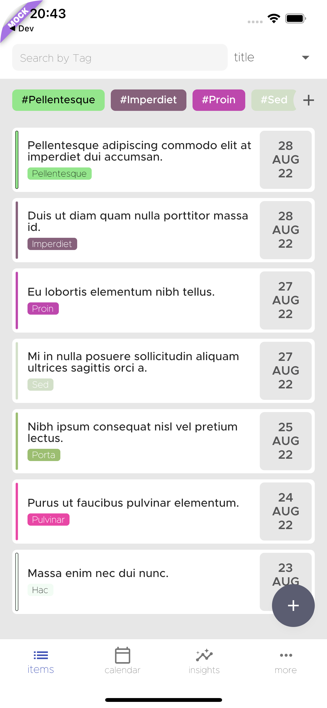
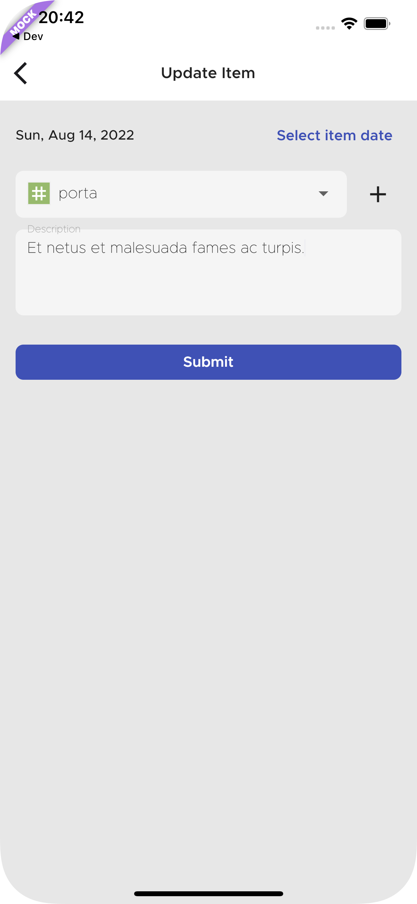
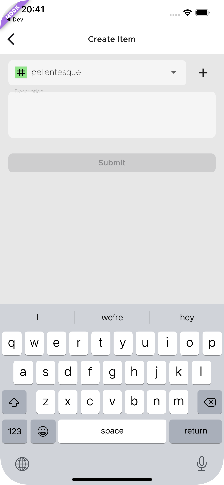
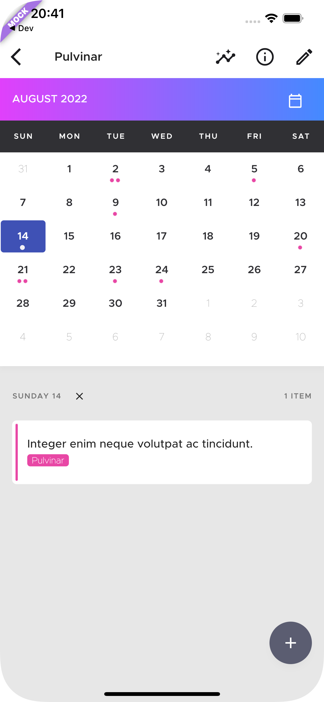
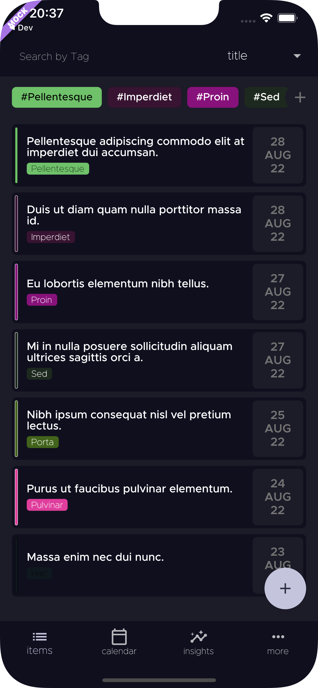
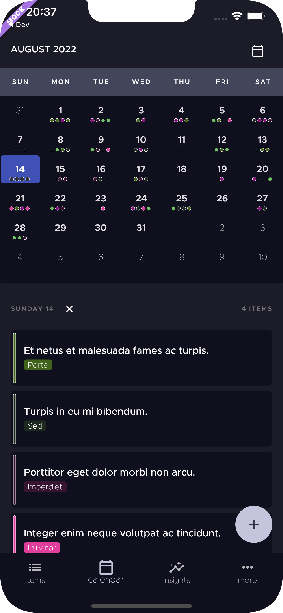
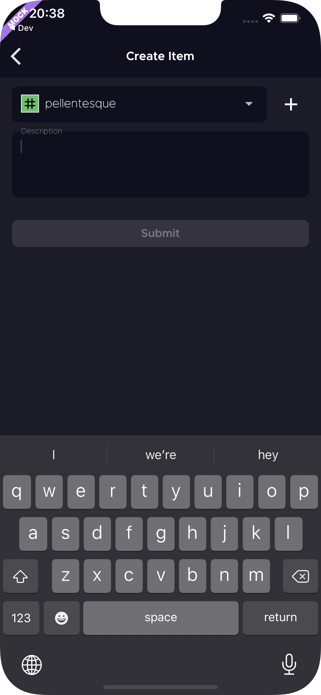
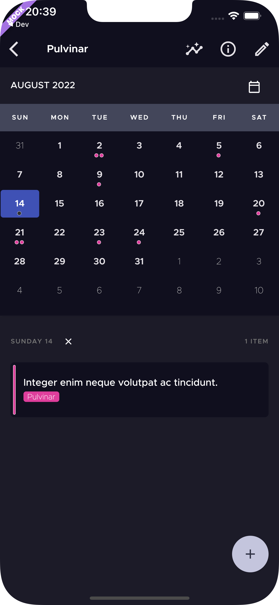

<div align="center">
  <h1>If I Remember Correctly (IIRC)</h1>
  <strong>For keeping track of important recurring events.</strong>
  <br />
  <sub>Built with ❤︎ by <a href="https://twitter.com/jogboms">jogboms</a></sub>
  <br /><br />

[](https://github.com/jogboms/iirc/actions/workflows/main.yml) [](https://codecov.io/gh/jogboms/iirc)

  <a href='https://play.google.com/store/apps/details?id=io.github.jogboms.iirc'></a>
</div>

---

## Getting Started

After cloning,

### FVM setup

Install `fvm` if not already installed.

```bash
dart pub global activate fvm
```

Install local `flutter` version.

```bash
fvm install
```

### Install, L10n & Riverpod code generation

```bash
fvm flutter pub get 
fvm flutter gen-l10n
fvm flutter pub run build_runner build
```

## Running

There are three (3) available environments:
- `mock`: Demo mode with non-persistent data
- `dev`: Development mode connected to firebase dev instance
- `prod`: Production mode connected to firebase production instance

To run in `mock` mode,

```bash
fvm flutter run --flavor mock --dart-define=env.mode=mock
```

## UI Shots

<div style="text-align: center">
  <table>
    <tr>
      <td style="text-align: center">
        
      </td>
      <td style="text-align: center">
        
      </td>
      <td style="text-align: center">
        
      </td>
      <td style="text-align: center">
        
      </td>
      <td style="text-align: center">
        
      </td>
    </tr>
    <tr>
      <td style="text-align: center">
        
      </td>
      <td style="text-align: center">
        
      </td>
      <td style="text-align: center">
        
      </td>
      <td style="text-align: center">
        
      </td>
      <td style="text-align: center">
        
      </td>
    </tr>
  </table>
</div>

## License

MIT License
